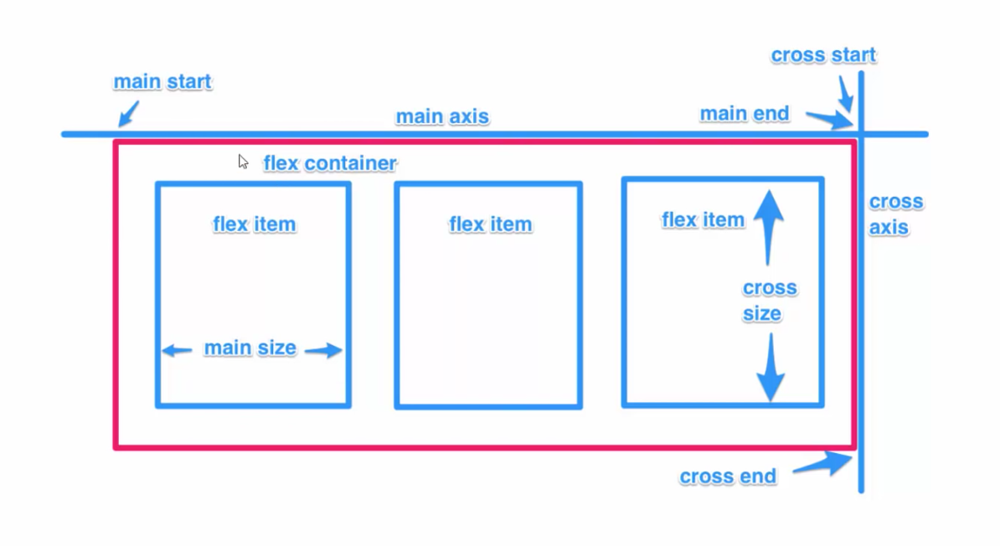

# Flex-box

## What is FlexBox
- A CSS3 layout mode that provides an easy and clean way to arrange items within a container
- No Floats
- Responsive and modible friendly
- Positioning child elements is Much easier
- Flex Container's margins do not collapse with the margins of its contents.
- Order of elements can easily be chnged without editing the source HTML.

## Flexible Box Model Concept
- The ability to alter item width and height to best fit in its containers available free space
- Flexbox is direction-agnostic
- Built for small-scale layouts while the upcoming "Grid" specification is for more large scale

## Flex Properties
- display: flex | inline-flex
- flex-direction: row | column
- flex-wrap: wrap | nowrap | wrapreverse
- flex-basis: < length >
- justify-content: flex-start | flex-end | center
- align-self : flex-start | flex-end | center
- align-items: flex-start | flex-end | center
- align-content: flex-start | flex-end | center
- flex-grow: < number >
- flex-shrink: < number >
- flex: < integer >
- order: < integer >

## Diagram
